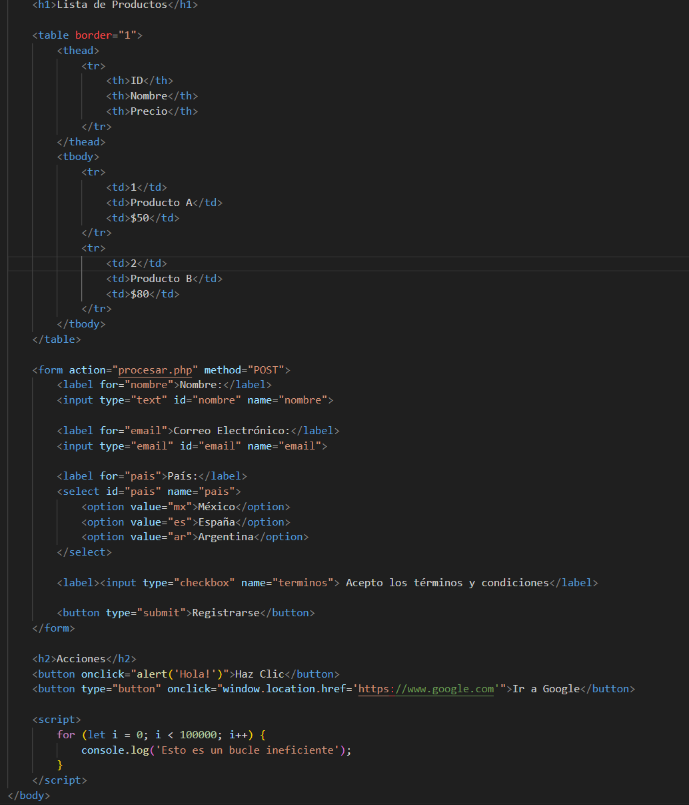
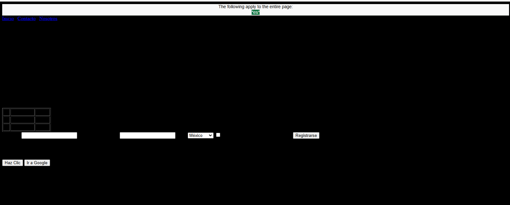
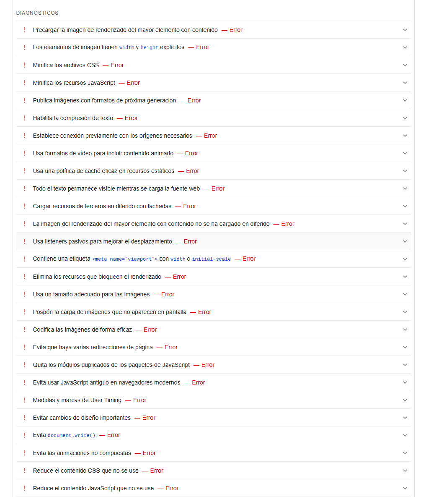
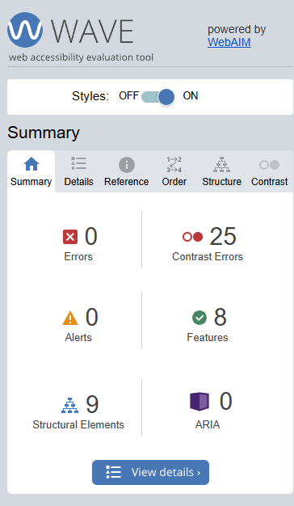
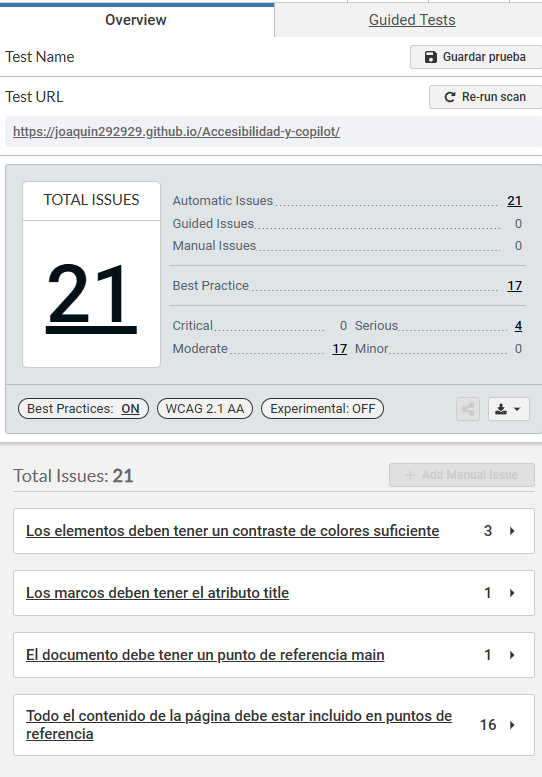
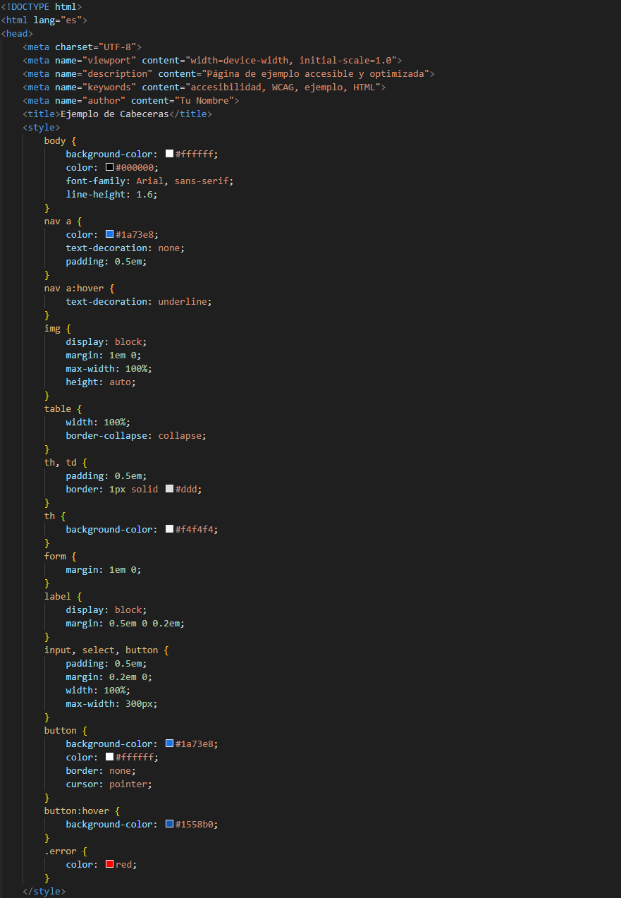
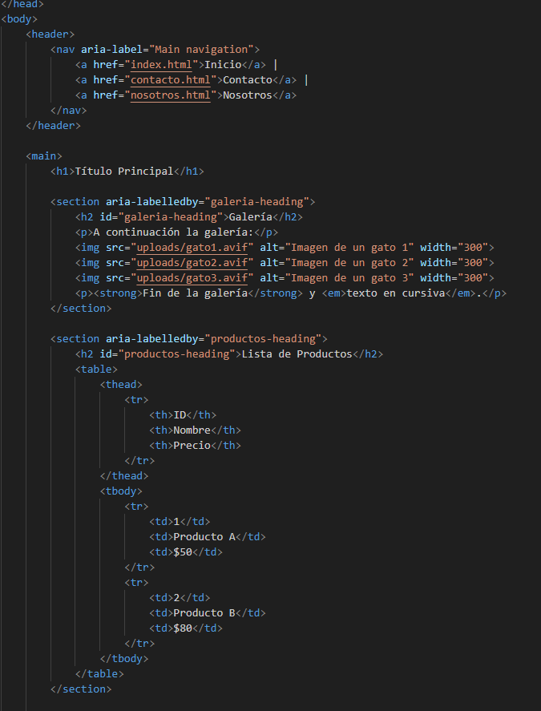
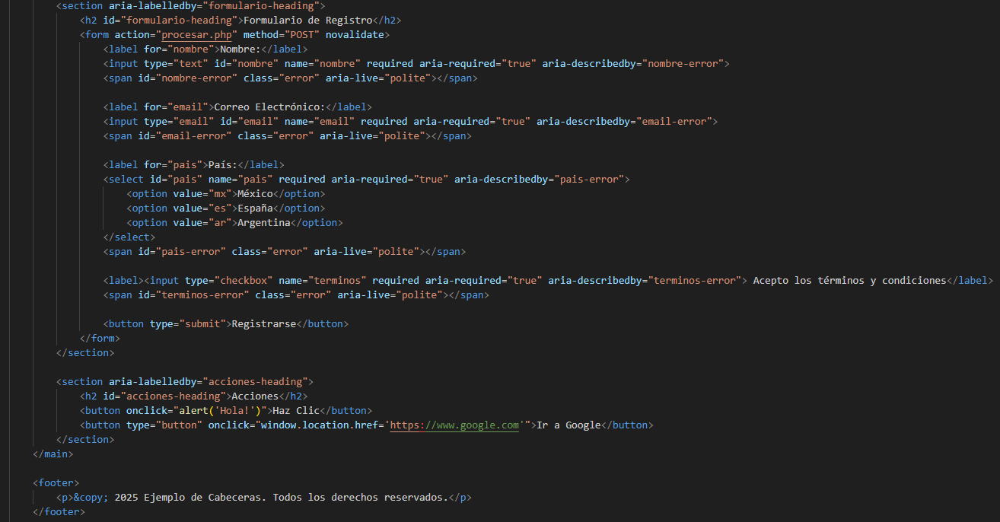
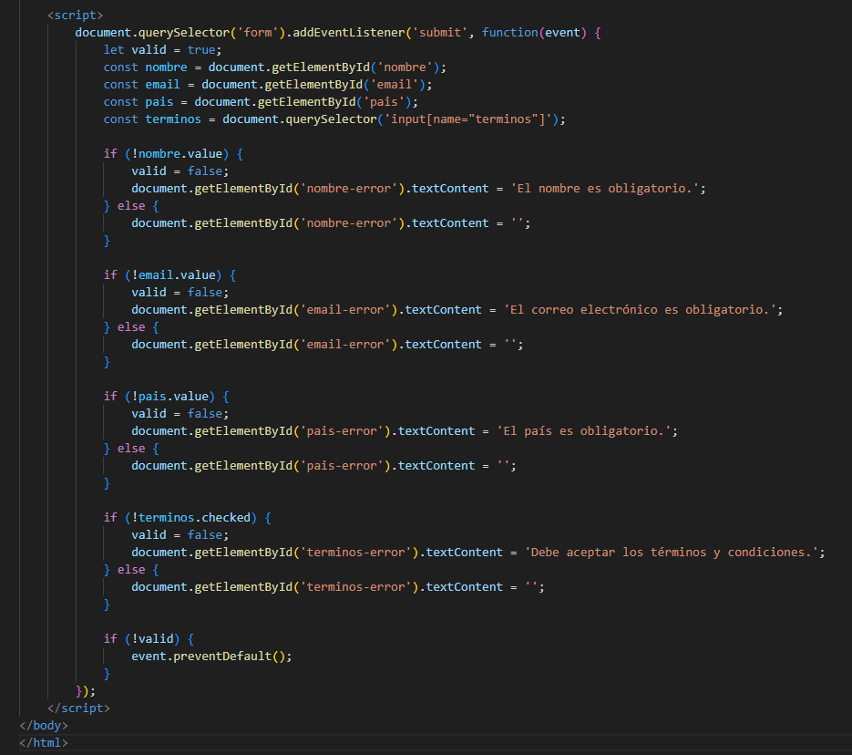
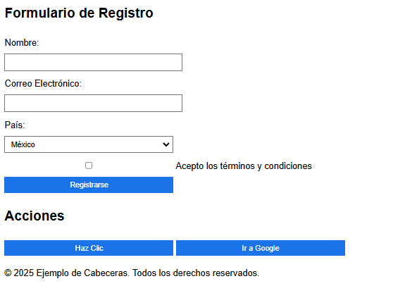

ENGLISH version

This project demonstrates the process of improving poorly structured code using artificial intelligence, in this case Copilot, to refactor and optimize the code step by step.

1. Initial Code (Poorly Done)

Below is the original code, which contains bad practices, such as poor accessibility and poor contrast for accessibility.

Page preview:

Detected Problems

    Color contrast:

        The background and text have the same color (#000), making the text unreadable.

    Images without alternative text:

        The images in the gallery do not have descriptive alt attributes, which affects accessibility.
        Inefficiency in the script:

    The script at the bottom of the document has a loop that runs 100,000 times, which can affect performance.

    Missing closing tags:

    The HTML document does not have a closing </html> tag.

    Use of obsolete attributes:

        The border attribute in the <table> tag is obsolete. It is better to use CSS for styling.

    Lack of accessible form labels:

        The form elements do not have proper label tags to improve accessibility.

    Missing lang attributes in html tags:

        The <html> tag has the lang="es" attribute, which is correct, but it is important to ensure it is present on all pages.

    Lack of error handling in the form:

        There is no validation or error handling in the form.

    Lack of descriptions on buttons:

        The buttons do not have clear descriptions of their functionality.

    Lack of semantic structure:

        The use of multiple <h1> tags can be confusing for screen readers. It is better to use a proper hierarchical structure with <h1>, <h2>, etc.

Accessibility validation tool results:

Lighthouse:

Wave:

Axe DevTools:

2. Using AI to Improve the Code

The following prompt was introduced in Copilot to request improvements in the code:

Objective: 
Make the page comply with WCAG 2.2 A, AA, and AAA standards, make it accessible, readable, maintain good performance, be fluid, and have several recommended practices.

Requirements: 
Make the page accessible and have good performance. 
Ensure good contrast (add a style for the page elements). 
Add aria attributes for descriptions. 
Add alternative texts for images. 
Add and remove all necessary tags. 
Avoid the use of obsolete attributes. 
Add the necessary meta tags. 
Ensure that the headings are hierarchical. 
Verify that the forms are accessible. 
Add error handling in the form. 
Add semantic structures. 
Do everything in this HTML. 
Remove all unnecessary elements. 
Frames must have a title attribute. 
All page content must be included in landmarks. 
Use an appropriate size for images.

3. Optimized Code

The final result after applying the AI suggestions:

Page preview:

Applied Improvements

Meta tags: Added keywords and author.
Contrast: Ensured good contrast on buttons.
ARIA attributes: Added aria-label, aria-labelledby, aria-describedby, and aria-live.
Alternative texts: Added alt to images.
Heading hierarchy: Verified and corrected.
Accessible forms: Added error handling and accessible error messages.
Semantic structures: Verified and corrected.
Image size: Ensured images do not exceed the container size.

4. Conclusion

This experiment demonstrates how AI can help improve code quality by detecting issues and suggesting best practices. Integrating tools like Copilot into development can accelerate code refactoring and optimization.

And we also conclude that an example of a perfect prompt would be the one already mentioned:

Objective: 
Make the page comply with WCAG 2.2 A, AA, and AAA standards, make it accessible, readable, maintain good performance, be fluid, and have several recommended practices.

Requirements: 
Make the page accessible and have good performance. 
Ensure good contrast (add a style for the page elements). 
Add aria attributes for descriptions. 
Add alternative texts for images. 
Add and remove all necessary tags. 
Avoid the use of obsolete attributes. 
Add the necessary meta tags. 
Ensure that the headings are hierarchical. 
Verify that the forms are accessible. 
Add error handling in the form. 
Add semantic structures. 
Do everything in this HTML. 
Remove all unnecessary elements. 
Frames must have a title attribute. 
All page content must be included in landmarks. 
Use an appropriate size for images.