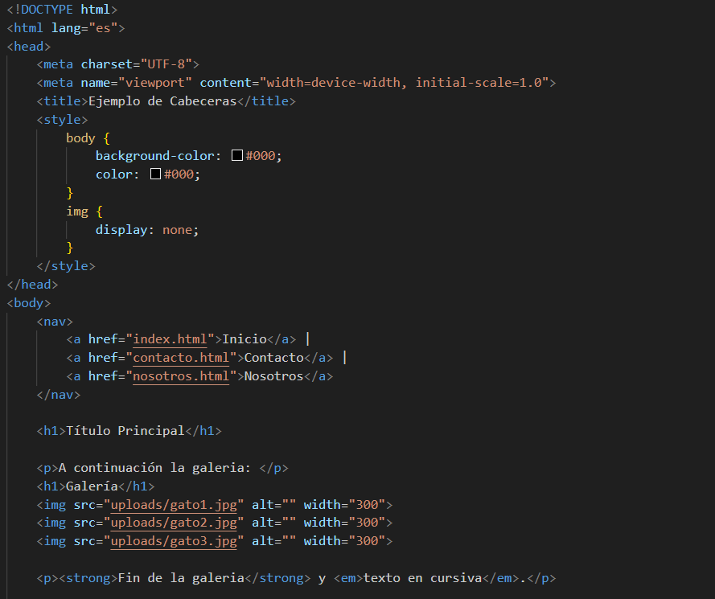
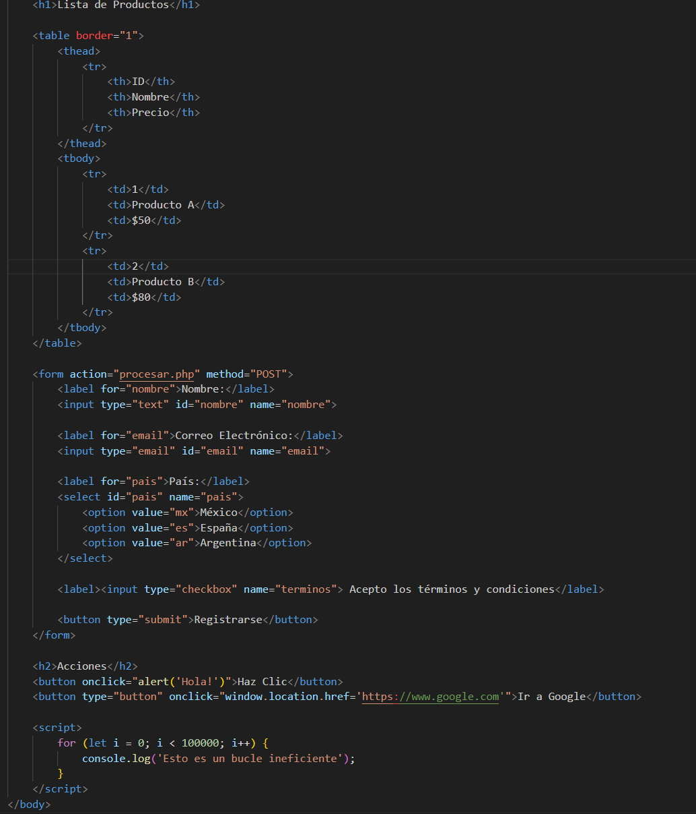
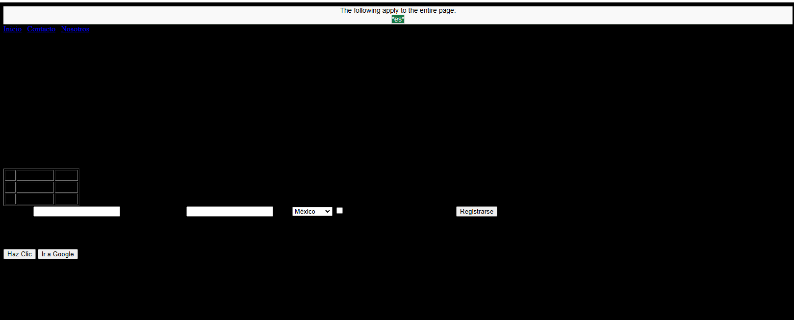
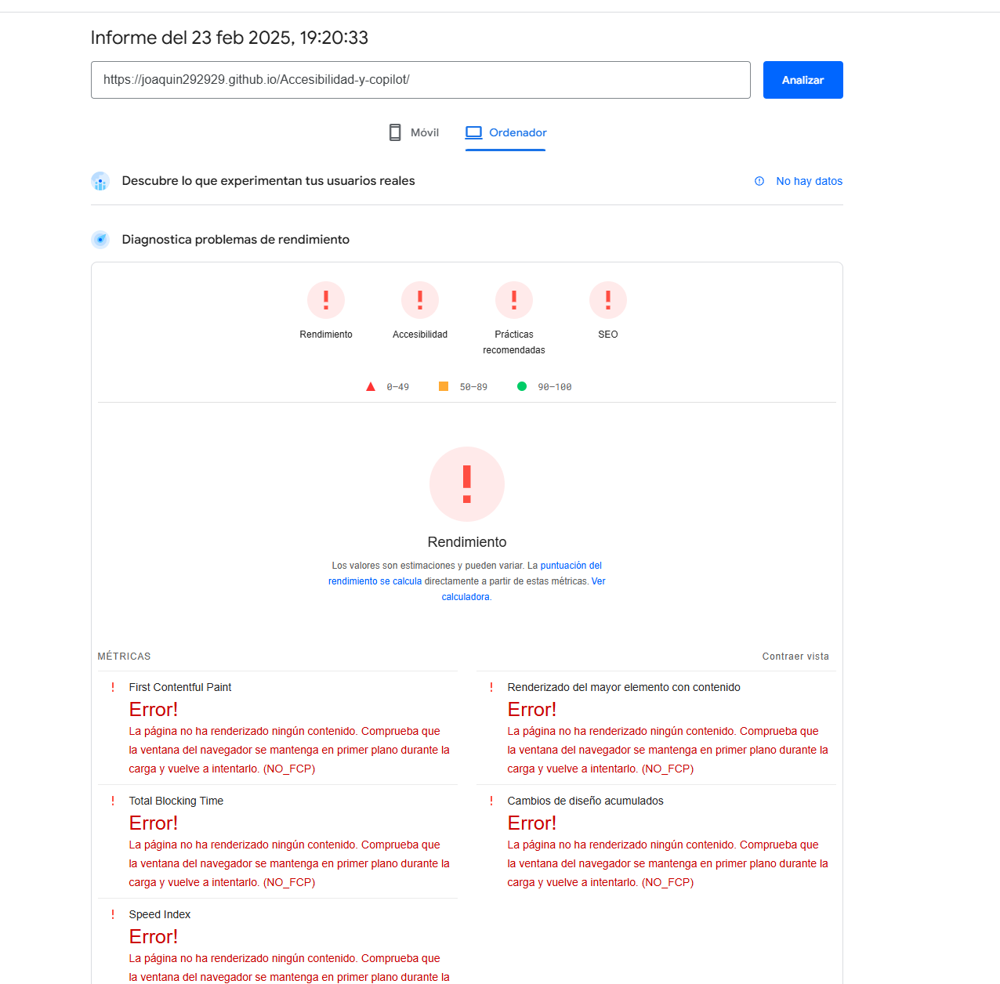
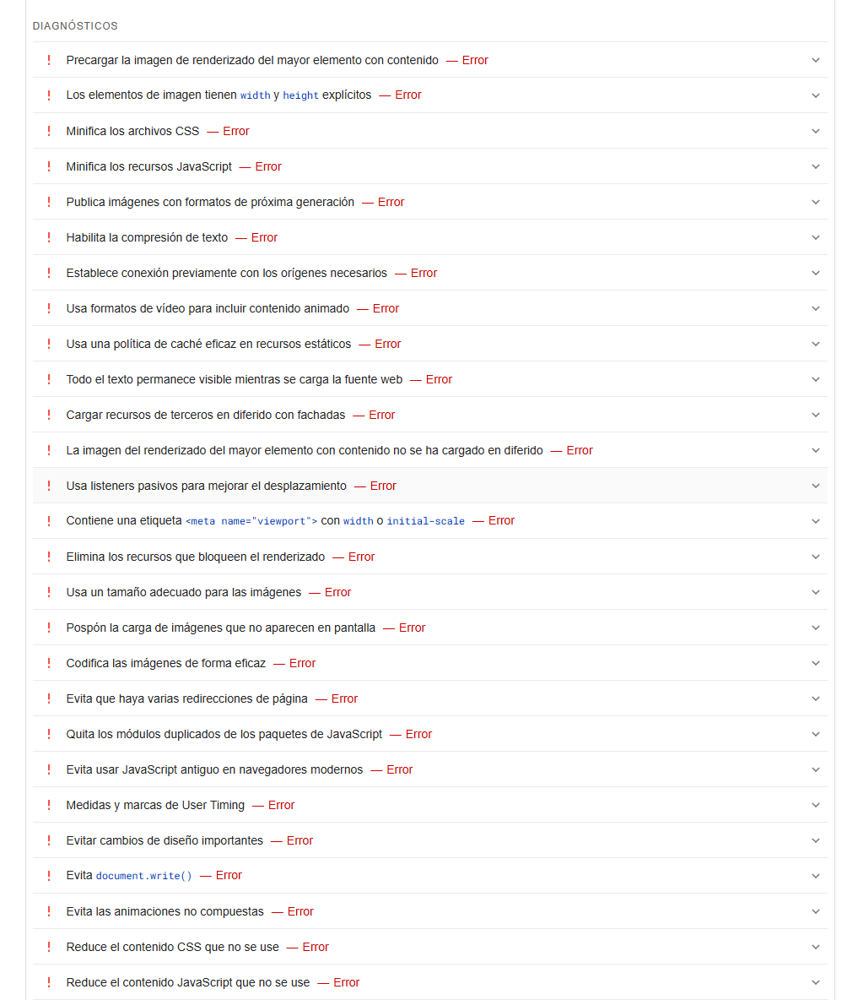
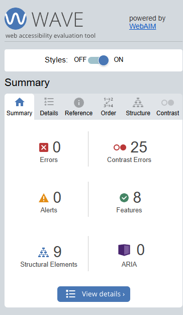
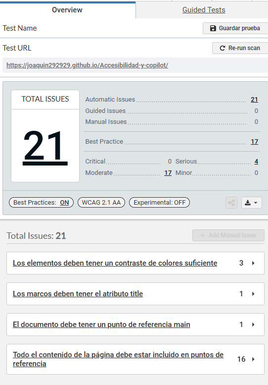

Este proyecto demuestra el proceso de mejora de un código mal estructurado mediante el uso de inteligencia artificial, en este caso Copilot, para refactorizar y optimizar el código paso a paso.

1. Código Inicial (Mal Hecho)

A continuación, se presenta el código original, que contiene malas prácticas, como poca accesibilidad y un mal contraste para la accesibilidad.

Previsualización de la página:

Problemas Detectados

    Contraste de colores:

        El fondo y el texto tienen el mismo color (#000), lo que hace que el texto sea ilegible.

    Imágenes sin texto alternativo:

        Las imágenes en la galería no tienen atributos alt descriptivos, lo que afecta la accesibilidad.
        Ineficiencia en el script:

    El script en la parte inferior del documento tiene un bucle que se ejecuta 100,000 veces, lo que puede afectar el rendimiento.

    Falta de etiquetas de cierre:

    El documento HTML no tiene una etiqueta de cierre </html>.

    Uso de atributos obsoletos:

        El atributo border en la etiqueta <table> está obsoleto. Es mejor usar CSS para el estilo.

    Falta de etiquetas de formulario accesibles:

        Los elementos del formulario no tienen etiquetas label adecuadas para mejorar la accesibilidad.

    Falta de atributos lang en las etiquetas html:

        La etiqueta <html> tiene el atributo lang="es", lo cual es correcto, pero es importante asegurarse de que esté presente en todas las páginas.

    Falta de manejo de errores en el formulario:

        No hay validación ni manejo de errores en el formulario.

    Falta de descripción en los botones:

        Los botones no tienen descripciones claras sobre su funcionalidad.

    Falta de estructura semántica:

        El uso de múltiples etiquetas <h1> puede ser confuso para los lectores de pantalla. Es mejor usar una estructura jerárquica adecuada con <h1>, <h2>, etc.

Resultado de las herramientas de validacion de accesibilidad:

Lighthouse:

Wave:

Axe DevTools:

2. Uso de IA para Mejorar el Código

Se introdujo el siguiente prompt en ChatGPT para solicitar mejoras en el código:

(prompt)

ChatGPT sugirió mejorar el código de la siguiente manera:

3. Código Optimizado

El resultado final tras aplicar las sugerencias de la IA:

Mejoras Aplicadas

4. Conclusión

Este experimento demuestra cómo una IA puede ayudar a mejorar la calidad del código al detectar problemas y sugerir buenas prácticas. Integrar herramientas como ChatGPT en el desarrollo puede acelerar la refactorización y optimización del código.

